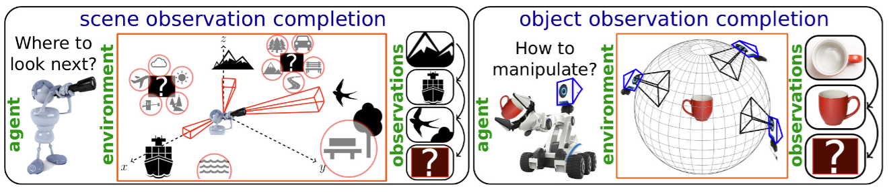
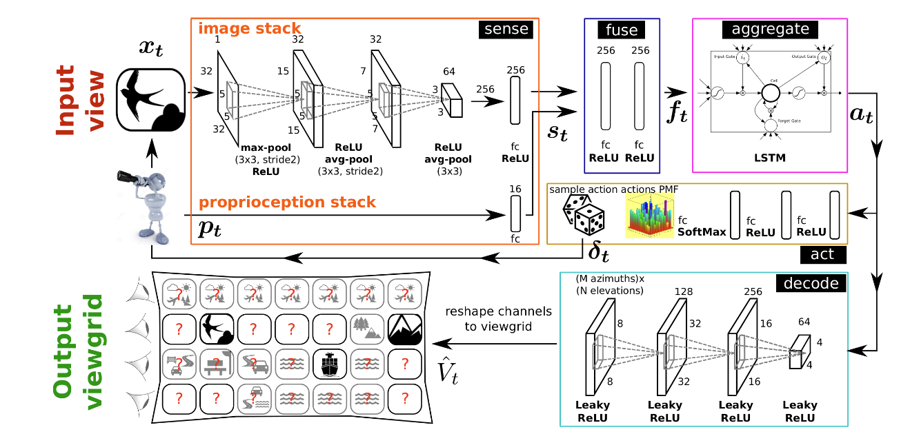
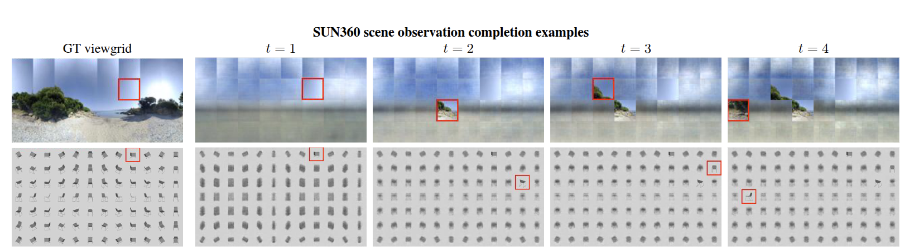
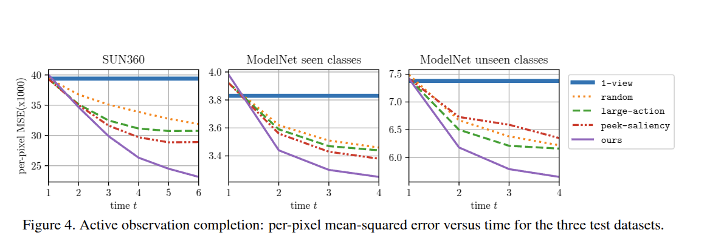
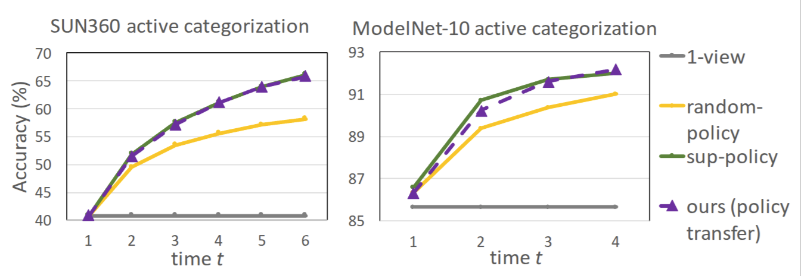
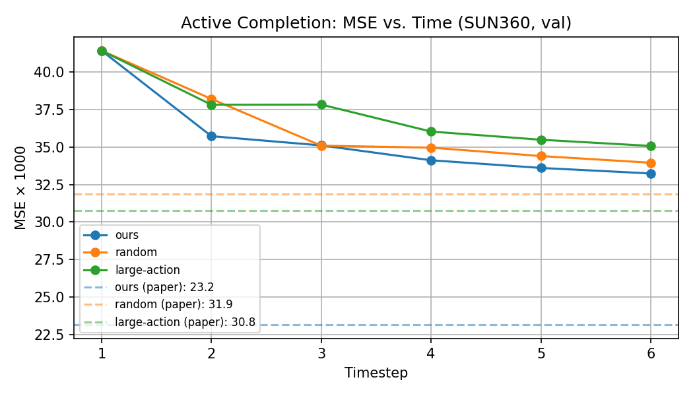
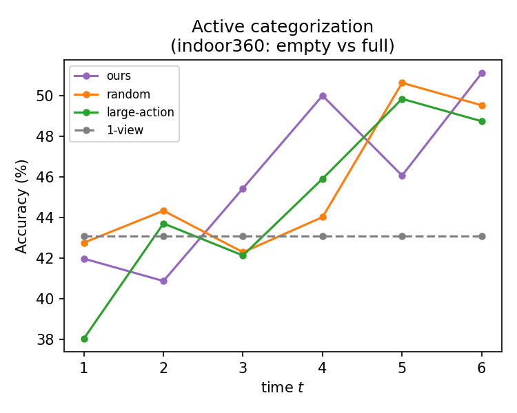
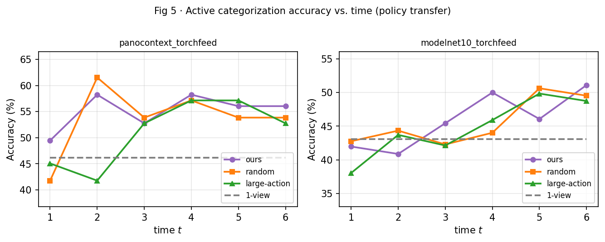

# Learning to Look Around — PyTorch 2026

Open source, Claude Code-based, 2026 PyTorch reimplementation of:

**"Learning to Look Around: Intelligently Exploring Unseen Environments for Unknown Tasks"**
Jayaraman & Grauman, CVPR 2018 — https://arxiv.org/abs/1709.00507

Reference Lua/Torch7 code: `origin_code/` (original, non-runnable)

---

## Paper Overview


*Fig. 1 — An agent observing limited portions of a scene must decide where to look next to most efficiently reduce uncertainty about unobserved regions.*

The paper proposes a reinforcement learning agent that learns to **actively complete panoramic scenes** by selecting informative viewpoints. The agent is rewarded for reducing its reconstruction error over unobserved views — no downstream task supervision required.

### Architecture


*Fig. 2 — Five modules: **sense** (CNN patch encoder + proprioception MLP), **fuse** (combine module), **aggregate** (LSTM memory), **decode** (transposed-conv viewgrid predictor), **act** (policy MLP).*

### Qualitative Results


*Fig. 3 — Active completion episodes. As the agent explores, its predicted viewgrid converges toward the ground truth. Top: outdoor scene. Bottom: 3D object (unseen category).*

### Quantitative Results


*Fig. 4 — Per-pixel MSE × 1000 vs. timestep on SUN360 (left), ModelNet seen (center), ModelNet unseen (right). The learned policy consistently outperforms random and large-action baselines.*

### Policy Transfer


*Fig. 5 — Unsupervised policy transfer: the completion policy (trained without labels) drives an active categorization system and matches the fully supervised baseline on both SUN360 and ModelNet-10.*

## Reproduction Results

The following plots are generated from this reimplementation and summarize reproducible evaluation outcomes across reconstruction quality and policy transfer settings.


*Reproduction eval (indoor360): per-timestep MSE curve comparing ours vs. random and large-action baselines.*


*Reproduction transfer eval (indoor360): policy transfer accuracy progression over timesteps.*


*Reproduction transfer eval (cross-dataset): policy transfer behavior on PanoContext and ModelNet-10.*

---

## Quick Start

```bash
# Install dependencies
uv sync

# Download SUN360 panoramas from HuggingFace and preprocess to HDF5
huggingface-cli download Everloom/SUN360 --repo-type dataset --local-dir /tmp/sun360_raw
uv run python data/prepare_sun360.py \
    --pano-dir /tmp/sun360_raw/train/RGB --out-dir data/sun360_torchfeed

# Train on SUN360 (~2 hours on cuda:2)
uv run python train.py --data-dir data/sun360_torchfeed --wandb --device cuda:2

# Train on indoor360 dataset (~2 hours on cuda:2)
uv run python train.py --data-dir data/indoor360_torchfeed --wandb --device cuda:2

# Evaluate a checkpoint
uv run python eval.py --checkpoint checkpoints/ckpt_epoch2000.pt \
    --data-dir data/indoor360_torchfeed --device cuda:2

# Policy transfer evaluation (Fig 5)
uv run python eval_transfer.py --checkpoint checkpoints/ckpt_epoch2000.pt \
    --data-dir data/modelnet10_torchfeed --device cuda:2

# Interactive visualization app
uv run python app.py --device cuda:2 --port 7860
```

### Interactive Viewer (`app.py`)

A Gradio web app (port 7860) with three tabs:

| Tab | What it does |
|-----|-------------|
| **Offline Results** | Displays pre-computed MSE curves (Fig 4) and policy transfer accuracy (Fig 5) from `results/`. Browse any val panorama as a 4×8 viewgrid. |
| **Live Episode** | Step through a single model episode interactively. Pick a val sample, policy, and start position; click *Next Step* to advance one timestep. Shows ground truth (red=current pos, gold=visited), predicted viewgrid, trajectory map, and MSE curve — all updating live. |
| **Run Full Eval** | Re-runs the full `eval_transfer` pipeline on any dataset in a background thread; saves a new `results/eval_transfer.png` when done. |

---

## TODO

### Setup
- [x] `uv init` — initialize project
- [x] Write `pyproject.toml` with all dependencies
- [x] `uv sync` — install deps (torch, torchvision, h5py, numpy, tqdm, wandb, matplotlib)
- [x] SUN360 dataset — available at `code-2017/SUN360/data/` (mini + full); full panoramas mirrored at [Everloom/SUN360](https://huggingface.co/datasets/Everloom/SUN360) on HuggingFace

### Data pipeline
- [x] `data/utils.py` — `get_view`, `circ_shift_viewgrid`, `paste_observed`, `step_position`
- [x] `data/sun360.py` — `SUN360Dataset` (HDF5 loader, train/val/test splits, handles Torch7 HDF5 transpose quirk)

### Models
- [x] `models/encoder.py` — `ViewEncoder` (3-layer CNN → 256D)
- [x] `models/location.py` — `LocationSensor` (MLP on elevation + relative motion → 16D)
- [x] `models/combine.py` — `CombineModule` (fuse patch+loc → 256D, BN+Dropout)
- [x] `models/memory.py` — `AgentMemory` (single-layer LSTM, hidden=256)
- [x] `models/completion.py` — `CompletionHead` (transposed-conv decoder → 32×3×32×32)
- [x] `models/actor.py` — `Actor` (3-layer MLP, input=hidden+rel_pos+time → 14 logits)
- [x] `models/baselines.py` — `RandomPolicy`, `LargeActionPolicy`

### Utilities
- [x] `utils/rewards.py` — `update_ema_baseline`, `compute_reinforce_loss`
- [x] `utils/logging.py` — wandb / console logging

### Training
- [x] `train.py` — Phase 1: pretrain T=1 (encoder + decoder only, 50 epochs)
- [x] `train.py` — Phase 2: full training T=6 (REINFORCE + reconstruction loss, 2000 epochs)
- [x] Gradient clipping (`max_norm=5.0`)
- [x] Checkpoint save/resume (`checkpoints/ckpt_epoch*.pt`)
- [x] Full training completed on indoor360 — recon loss converges over 2000 epochs
- [x] Training on SUN360 dataset — preprocess with `data/prepare_sun360.py --pano-dir /path/to/SUN360/RGB --out-dir data/sun360_torchfeed`; panoramas available at [Everloom/SUN360](https://huggingface.co/datasets/Everloom/SUN360)

### Evaluation
- [x] `eval.py` — per-pixel MSE×1000 at final step T on val/test set
- [x] Compare vs. `RandomPolicy` and `LargeActionPolicy` baselines
- [x] Plot MSE vs. timestep curve
- [x] Full 2000-epoch training on indoor360 (`cuda:2`, ~2 hours) — ours=23.71, random=26.62, large-action=27.05 MSE×1000
- [x] `eval_transfer.py` — Fig 5 policy transfer (per-timestep accuracy curves for 4 policies)
- [x] ModelNet-10 rendering pipeline (`data/prepare_modelnet.py`, pyrender+EGL) — 32 views/model, 4899 models
- [x] PanoContext dataset pipeline (bedroom/living_room, 2-class, 706 panoramas)
- [x] `plot_fig5.py` — combined two-panel Fig 5 reproduction
- [x] `app.py` — interactive Gradio visualization app (offline + live episode + full eval tabs)

### Done
- [x] Design doc (`designdoc.md`) — v2.0, corrected from paper + Lua reference code
- [x] README with paper figures (`readme.md`)
- [x] Full 2000-epoch training completed (`checkpoints/ckpt_epoch2000.pt`)
